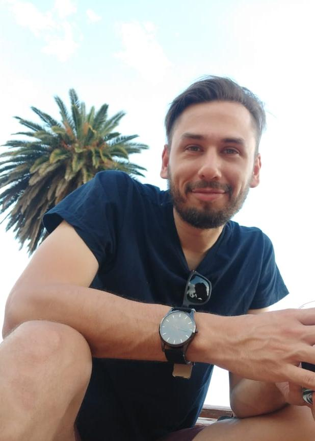

# **Nicolás Nahuel Moreyra**

  

## **Personal information**

+ Date of birth: October 4th, 1989
+ Nationality: Argentinean
+ E-Mail Personal: [niconm89@gmail.com](mailto:niconm89@gmail.com)
+ E-Mail Laboral: [nmoreyra@ege.fcen.uba.ar](mailto:nmoreyra@ege.fcen.uba.ar)
  
### **Social/Scientific Networks**

+ Linkedin: [Nicolás Moreyra](https://www.linkedin.com/in/nicolasmoreyra/)
+ GitHub: [Nicolás Moreyra](https://github.com/niconm89)
+ Google Academics: https://scholar.google.com/citations?hl=es&user=2ygu-Z8AAAAJ
+ ORCID: https://orcid.org/0000-0003-0451-2399

### **About me**

I have a BSc. in Bioinformatics and a Ph.D. in Biological Sciences oriented to evolutionary biology. I am passionate about next generation sequencing technologies, omic sciences and programming to answer biological questions.

## **Education**
  | Name                                                              | Project title              |    School                    | Start Date | End Date |
  |-------------------------------------------------------------------|----------------------------|------------------------------|------------|----------|
| BSc. in Bioinformatics | Facultdad de Ingeniería (FI), Universidad Nacional de Entre Ríos (UNER). Oro Verde, Entre Rios, Argentina.            | Deconvolution of ELISPOT T-cell responses against HIV using immunoinformatic screening methods. |   2008   |   2014   |
| Ph.D. in Biological Sciences | Facultad de Ciencias Exactas y Naturales (FCEyN), Universidad de Buenos Aires (UBA). Ciudad de Buenos Aires, Argentina. | Genome assembly and comparative analysis of the species D. borborema, D. antonietae y D. koepferae (Drosophila buzzatii cluster, repleta group).  |   2015   |   2020   |
| Postdoctoral Studies        | UBA-CONICET      | 2021          | Present      |

  
 ### **Other background**
   | Name                                                              | School                    | Start Date | End Date |
|---------------------------------------------------------------------|-----------------------------------------|---------------|------------|
| First Certificate of English | British Council          | 2013          | 2016       |
| French B1 Level                                              | Escuela Oficial de Idiomas | 2013          | 2015       |
| Regional Fencing Referee        | Federación Madrileña de esgrima      | 2015          | 2015     |
| National Fencing Referee | Real Federación Española de esgrima        | 2016          | 2016       |

  ### **Technical Skills**

#### Experince working in omic-related fields:
  + UNIX/Linux systems user
  + Experience working in HCP servers.
  + High-throuput sequencing data QC and curation (single-end, pair-ends, mate-pairs and long reads)
  + Repeat library generation and Transposable Element annotation
  + Genome assembly and annotation
  + Gene annotation curation (e.g. Apollo)
  + Orthology search/prediction
  + Management of genomic files such as gff, fasta, bed and related formats
  + Phylogenomics: phylogeny reconstruction and divergence time estimation
  + Molecular evolution analysis
  + Transcriptome assembly
  + Differential expresion analysis
  + Sequencing Experimental Design
  + Metagenomics (beginner)

#### Programming Languajes and Frameworks:
  + Python
  + Bash
  + AWK
  + R
  + Perl
  + C++ (bassic)
  
#### Other Knowledge:
  + Collaborative work on GitHub and GitLab
  

## **Work Experience**

+ Maths and English private teacher
+ National and regional fencing referee
+ Youth centre monitor
+ Radio advertisements marker at ArceMedia
+ Web designer y Web master for:
    + [Pepu Alcalde](http://pepualcalde.org/)
    + [Tecrima](https://www.tecrima.com/)
+ Waiter at Covanegra Restaurant(Capdepera, Mallorca)
+ Software Engineer Intern at Avanade S.L.U: Jan. 2020 - May. 2020
    + During the internship it was mostly training in web technologies such as AngularJS.
+ Junior Developer at Aghasa Turis: Jun. 2020 - Present
    + Currently my functions consist of the development and implementation of web and desktop applications using web technologies such as Node.js, ExpressJS, Vue.js, etc...

## **Other Info**

 - Eagerness to learn and face new challenges
 - Versatil and tenacious
 - Ability to work in teams as well as to carry out autonomous projects
 - Communication and social skills
 - Commitment, responsibility and determination to my duties
 - Pro-active
 - Sociable
 - Ability to create practical solutions
